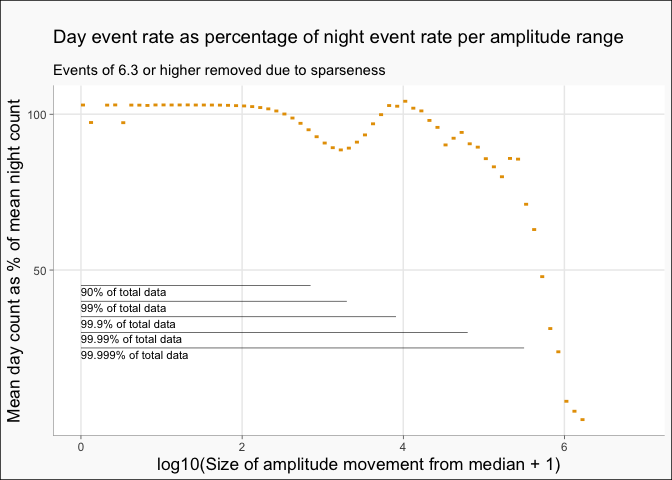

Individual seismograph readings are being looked at to inform the discussion about the Geonet earthquake database having significantly more earthquakes at night.

A particular, discussion focus was on the STA/LTA caluclation for determining likely earthquakes, where STA/LTA is

$$
\frac{mean(squaredAmplitudeSamplesFromShortTermWindow)}{mean(squaredAmplitudeSamplesFromLongTermWindow)}
$$

With the unusual high signals of earthquake events being more dominant in the short term time window when compared to the long term time window where background noise is more dominant. If daytime noise is high enough it could be lowering the ratio (via raising the denominator in proportion to the numerator) enough to miss earthquakes give a similar rate of events in the day and night. If noise is not the cause then large signal readings should actually be occurring more frequently at night.

Matawai/ MWZ is being looked at in detail, as the first seismograph considered (HAZ) showed a moving skew in the overall distribution through the day, and Matawai is near to an Electronic Weather Station that records hourly temperature for examining that phenomena. The two stations share the features of being located near to the East Cape, which has a very high proportion of recorded nighttime earthquakes, the seismographs recording more extreme events at night, and the seismograph showing a daily moving skew in the distribution of recorded entries.

## Specific Terms

For this I am using a few specific terms

* *Amplitude Distance* for the size of amplitude movements on the seismograph measured as the absolute value distance from the median of the 10 minute period the reading took place in. Standard calculations are based on the raw value, but with the offset generated by the skew I wanted to focus of the size of the difference from normal of readings.
* *Extreme events* are amplitude distances so large that they occur at a rate of less than approximately 1 in 10,000 readings (100 in a million) in the data from this seismograph. The level is so high to be clear of all potential human noise at lower readings. Because of binning the data into steps for easy of analysis, this seismograph was technically the slightly tighter criteria of 98.2 in a million for amplitude moves of 10^4.8 or greater.

## MWZ Matawai

Location 10, Sensor HHZ

Longitude: 177.528, Latitude: -38.334

Data downloaded as 10 minute intervals from 2010-12-31 to 2021-06-01 (UTC timezone) with 79 days of data unavailable. With 100 samples per second, there are 32,023,172,557 readings in total. Of those readings 15,958,217,096 are in day, 16,064,955,461 at night (where day is on or above the horizon at the centre of the 10 minute interval). As there are 60,000 readings in a 10 minute period where the seismograph did not go off line, that is easily sufficient to establish accurate summary values for each 10 minute period. As there are around 52560 10 minute periods a year for a year of full operation, more than a decade's of readings gives a large number of independent 10 minute samples.

As the number of entries in different analytical categories can vary, I am making heavy use of average values per 10 minute unit, since increasing the sample size increases the accuracy of the average value (in a Central Limit Theorem square root of the increase in sample kind if way)

For analysis of the size of amplitude movements away from the centre of the 10 minute range, to make the analysis tractable as an exploratory analysis on a standard laptop I binned the size of the movement into log10(x+1)/10 steps. So the smallest moves were in the 0-0.1 (0 to 1.2589 raw amplitude measure away from the median) range, and the largest moves in the data set were in the 6.8-6.9 (6309573 to 7943282 raw amplitude measure away from the median).

This data has also been linked with the NIWA Motu electronic weather station (Longitude: 177.52941,Latitude: -38.28566) 5.3 km away to compare its hourly temperature readings for investigating skew. 87,832 readings are available on the hour for both the seismograph and thermometer.

## Sensor activity

For my original motivating interest, that there are more earthquakes in the catalogue that occur at night, I checked the number of extreme amplitude movements. Readings of that strength occur at an average rate per 10 minute period 24% higher in night than in day (6.52 per 60,000 readings at night vs. 5.26 per 60,000 readings in the day).

## Noise

While I avoided the effect of noise on the determination of an earthquake by only looking at extreme events, having this much data can say some things about noise (where noise is the replacement/ masking of quieter movements by higher strength sources of vibration up to the maximum level of noise production, mostly during the day).

The aggregate pattern caused by increased noise is a lower readings of quiet (readings central to the distribution), higher levels of readings of noise in the range of the noise production, then unaffected above that. This means we can compared distributions at different times from the same site to gauge the relative effects of noise between those times.

<!-- -->
The daytime and night range, and frequency of that range, is fairly similar, and while daytime events do occur at a higher rate up to 2.5 (moves of 10^2.5-10^2.6), nighttime events occur at a higher rate above that movement bin. Because this change over is close to the peak in the data, this means that, broadly, daytime events are more common among movements in the lower half of the data and nighttime events are more common among movements in the upper half (not just the upper 1/10,000th extreme values).

This is not the expected pattern for noise under the assumption of the same distribution of day and night earthquakes. There, daytime noise is replacing quieter values with larger movements giving a pattern of nighttime dominance in the smallest ranges, followed by an artificial inflation of daytime values in the medium ranges, followed by a similar rate for both in the extreme ranges unaffected by noise.

Because this is not the expected pattern, and the largest counts on the graphs have 1,000 times the smaller steps so it is hard to see the detail, I thought it worth exploring the imbalance at each individual step of amplitude distance relative to those movements in the alternative cycle, in order to better see the relative distances.

<!-- -->

View as the per amplitude bin difference, there is a rise in daytime events (following a period of night dominance at lower levels of activity) peaking at 4. If this is noise, then as the volume of data is reducing the rise is insufficient to account for the swing to night at low levels of activity (nor the continuing trend afterwards). However, if it is noise that un-masked would cause noise entries to otherwise be to the left of their measured position, that would create a steadier gradient in the progression to more extreme events at night.

## The skew

The entire distribution of recorded results moves through the day.

<!-- -->

## Temperature

With the suggestion that the skew is caused by temperature, I am plotting the same distribution of centres for those entries that have EWS temperature readings.

<!-- -->

From that, it is absolutely clear that as the air temperature gets above 20 degrees the seismograph skews, and almost all of the above 20 degrees readings are in the day. So that is the reason, but the question open as to if the skew is influencing results.

Restricting the temperature range to only those entries in the 1 to 20 degree operating range increases the imbalance in extreme events from the nighttime rate being 24% above the day rate to the nighttime rate being 35.6% above the day rate. If removing the values in the skewed region of the data increases the differential, it is unlikely that the skewed region is causing the differential.

The reason excluding the above 20 degree values has such a dramatic effect is that the majority of daytime large amplitude events occur during the afternoon, and afternoons are the time when most of the above 20 temperatures are (which is also the time when the sun as a gravitational source is travelling through an arc in line with the subduction zone, as is the case with the main time of nighttime extreme events).

